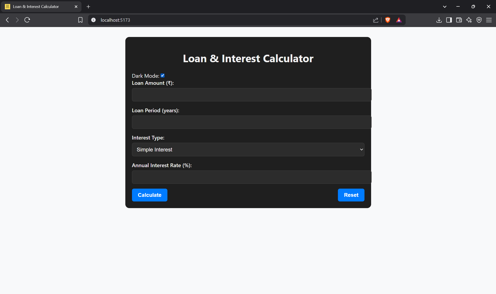

# 💰 Loan & Interest Calculator

A professional and user-friendly Loan & Interest Calculator built with React. This tool helps users compute:

- Simple Interest
- EMI-based interest
- Custom rate formats (e.g., ₹1 per ₹100 per month)
- Total repayment amount
- Monthly EMI
- Interest paid

📈 Includes a comparison chart (EMI vs Interest) and export options (PDF & CSV). Fully responsive and dark mode supported.

---

## ✨ Features

- 📊 Simple & EMI-based interest calculation
- 📦 Export results to **PDF** and **CSV**
- 🌗 Dark Mode toggle
- 📱 Mobile responsive UI
- 📉 Dynamic chart with **Recharts**
- 🧮 Custom calculation support (e.g., ₹1 per ₹100/month)

---

## 🔧 Technologies Used

- [React](https://reactjs.org/)
- [Recharts](https://recharts.org/)
- [jsPDF](https://github.com/parallax/jsPDF)
- [html2canvas](https://github.com/niklasvh/html2canvas)
- [react-csv](https://github.com/react-csv/react-csv)

---

## 🚀 Getting Started

### Prerequisites

Make sure you have **Node.js** and **npm** installed:

```bash
node -v
npm -v
```

### Installation

1. Clone the repository:
   ```bash
   git clone https://github.com/your-username/loan-interest-calculator.git
   cd loan-interest-calculator
   ```

2. Install dependencies:
   ```bash
   npm install
   ```

3. Run the development server:
   ```bash
   npm run dev
   ```

4. Open in browser:
   ```
   http://localhost:5173
   ```

---

## 📸 Screenshots

> Include screenshots in a `/screenshots` folder and reference them here:

- 
- 

---

## 📁 Project Structure

```
├── public/
├── src/
│   ├── App.jsx
│   ├── App.css
|   ├── main.jsx
│   ├── components/
├── README.md
└── package.json
```

---

## ✅ To-Do (Enhancements)

- Add currency converter
- Multi-language support
- Save previous calculations

---

## 🙌 Acknowledgements

Thanks to open-source packages and the React community!
